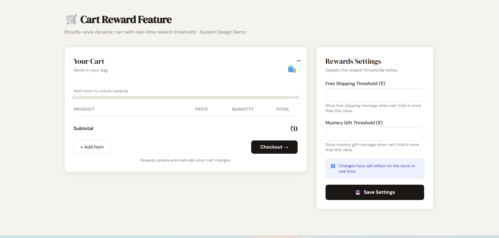
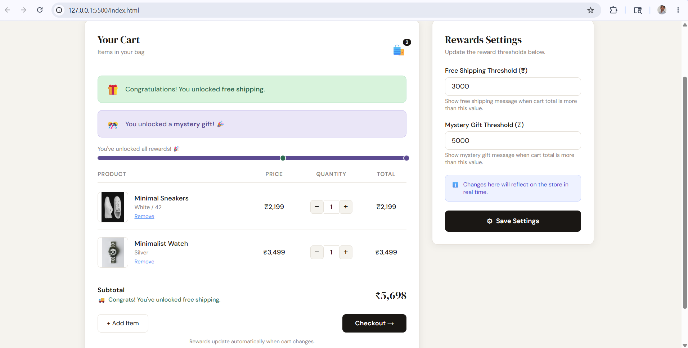
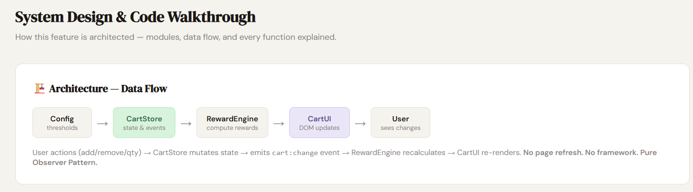

Cart Rewards Feature

A production-style cart rewards system built with Vanilla JavaScript using the Observer Pattern (Pub-Sub Architecture).

This project demonstrates how modern ecommerce cart systems can be built without frameworks while maintaining scalability, modularity, and clean architecture.

# Features
Free shipping reward threshold
Mystery gift reward threshold
Dynamic progress bar
Real-time cart updates
Toast notifications
Quantity stepper
Admin settings panel
Reactive UI updates
Event-driven architecture
Fully modular codebase
Tech Stack
HTML5
CSS3
Vanilla JavaScript
Observer Pattern (Pub-Sub)

No frameworks or external libraries used.

# Folder Structure
project/
│
├── index.html
├── style.css
├── app.js
│

    └── images/
        └── products/
            ├── backpack.webp
            ├── sneakers.webp
            ├── silver_watch.webp
            ├── cap.webp
            └── sunglasses.webp

# Setup Instructions
1. Clone Repository
git clone https://github.com/rajudhuriya90/cart-rewards-feature.git

2. Open Project
cd shopify

3. Run Project

Simply open:
index.html
in the browser.
Or use VS Code Live Server extension.

# Architecture Overview

This project follows the Observer Pattern (Publish-Subscribe) architecture.

Modules communicate only through EventBus events.

No module directly depends on another module.

Benefits:

scalable
loosely coupled
testable
maintainable
replaceable modules

# # Demo Logic

Initial seeded cart:

Classic Backpack → ₹1,799
Minimal Sneakers → ₹2,199

Initial total:

₹3,998

This automatically unlocks:

free shipping
progress milestone updates

# How To Start
Option 1 — Directly Open in Browser

Open:

index.html

in your browser.

Option 2 — VS Code Live Server (Recommended)
Step 1

Install VS Code extension:

Live Server
Step 2

Open project folder in VS Code.

Step 3

Right click:

index.html
Step 4

Click:

Open with Live Server

Project will start automatically in browser.

# Author

Built by Raju Dhuriya

Frontend Developer focused on scalable ecommerce UI and Vanilla JavaScript architecture.

# Screenshots

## Main UI

## Threshold Settings

## System Design

